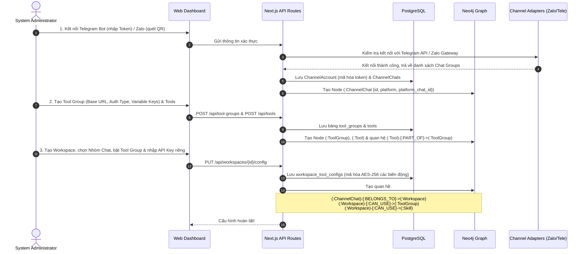
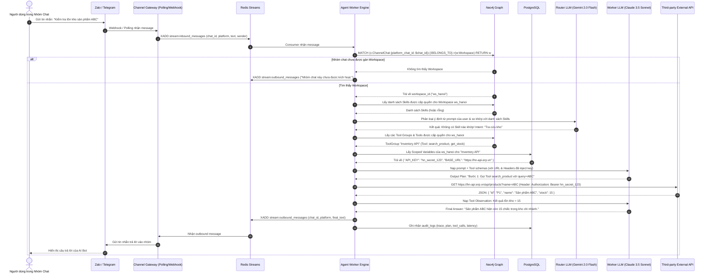
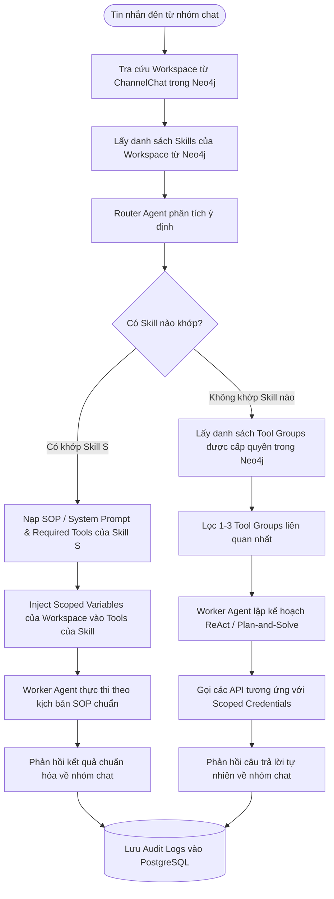

# 04. Luồng Di chuyển của Người dùng & Xử lý Hệ thống (User Flows & System Sequence)

## 1. Luồng 1: Admin Thiết lập Kênh, Tool và Không gian làm việc (Setup Flow)

Luồng này mô tả các bước mà System Administrator thực hiện trên Web Dashboard để đưa một nhóm chat vào hoạt động với các công cụ cụ thể:

---

## 2. Luồng 2: Xử lý Tin nhắn Đến & Định tuyến Multi-Agent (End-to-End Chat Routing Flow)

Đây là luồng cốt lõi vận hành khi có tin nhắn từ người dùng trong nhóm chat Zalo hoặc Telegram:

---

## 3. Luồng 3: Trường hợp Khớp Skill Chuyên biệt (Skill-First Flow)

Khi Router Agent xác định yêu cầu của người dùng khớp chính xác với một **Skill** đã được tạo sẵn trong Workspace:

---

## 4. Cơ chế Xử lý Lỗi & Dự phòng (Fail-Safe & Edge Cases)
1. **API Bên thứ ba lỗi hoặc Timeout (> 10s):**
   * Worker Agent bắt ngoại lệ (Catch HTTP Error 5xx/Timeout).
   * Agent tự động đưa thông báo giải thích ngắn gọn, lịch sự cho người dùng ("Không thể kết nối đến hệ thống kho chi nhánh lúc này, vui lòng thử lại sau giây lát").
   * Ghi nhận trạng thái `FAILED` kèm mã lỗi chi tiết vào `audit_logs` để Admin kiểm tra trên Dashboard.
2. **Kênh Zalo/Telegram bị mất kết nối (Token hết hạn / Cookie bị logout):**
   * Background Healthcheck định kỳ 60s kiểm tra trạng thái các tài khoản.
   * Nếu phát hiện lỗi xác thực $\rightarrow$ Cập nhật `channel_accounts.status = 'EXPIRED'`.
   * Gửi cảnh báo lên UI Dashboard để Admin đăng nhập lại.
3. **Người dùng hỏi nội dung ngoài phạm vi Tool/Skill được cấp:**
   * Router Agent nhận thấy không có Skill hoặc Tool nào đáp ứng được câu hỏi nghiệp vụ.
   * Agent phản hồi câu trả lời trò chuyện tổng quát hoặc lịch sự từ chối: "Tôi chưa được phân quyền thực hiện tác vụ này trong không gian làm việc của bạn."
