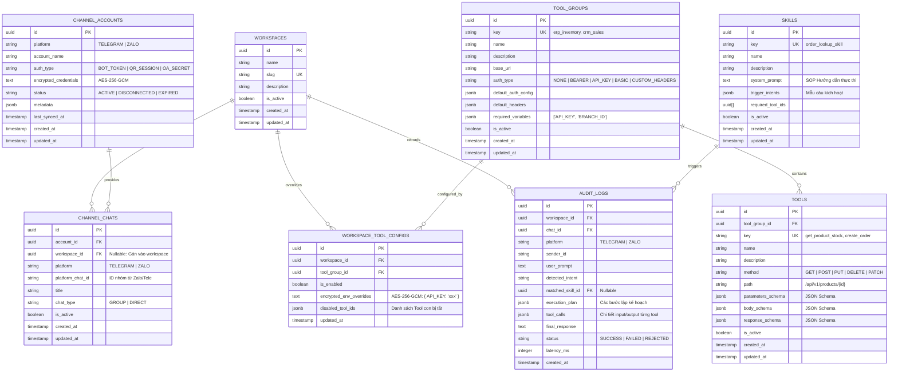

# 06. Thiết kế Sơ đồ Cơ sở Dữ liệu (Database Schema & Graph ERD)

## 1. Sơ đồ Thực thể Quan hệ PostgreSQL (Postgres ERD)

PostgreSQL đảm nhiệm vai trò lưu trữ bền vững (System of Record), hồ sơ cấu hình, metadata JSON Schema và toàn bộ lịch sử thực thi (Audit Logs).



---

## 2. Chi tiết Định nghĩa Bảng trong PostgreSQL (Prisma Schema DDL)

Dưới đây là đặc tả kỹ thuật chi tiết các bảng cho Prisma ORM:

```prisma
datasource db {
  provider = "postgresql"
  url      = env("DATABASE_URL")
}

generator client {
  provider = "prisma-client-js"
}

enum PlatformType {
  TELEGRAM
  ZALO
}

enum ChannelAccountStatus {
  ACTIVE
  DISCONNECTED
  EXPIRED
}

enum HttpMethod {
  GET
  POST
  PUT
  DELETE
  PATCH
}

enum AuthType {
  NONE
  BEARER
  API_KEY
  BASIC
  CUSTOM_HEADERS
}

enum AuditStatus {
  SUCCESS
  FAILED
  REJECTED
}

model Workspace {
  id          String   @id @default(uuid()) @db.Uuid
  name        String
  slug        String   @unique
  description String?
  isActive    Boolean  @default(true)
  createdAt   DateTime @default(now())
  updatedAt   DateTime @updatedAt

  channelChats         ChannelChat[]
  workspaceToolConfigs WorkspaceToolConfig[]
  auditLogs            AuditLog[]

  @@map("workspaces")
}

model ChannelAccount {
  id                   String               @id @default(uuid()) @db.Uuid
  platform             PlatformType
  accountName          String
  authType             String
  encryptedCredentials String               @db.Text
  status               ChannelAccountStatus @default(ACTIVE)
  metadata             Json?                @default("{}")
  lastSyncedAt         DateTime?
  createdAt            DateTime             @default(now())
  updatedAt            DateTime             @updatedAt

  channelChats ChannelChat[]

  @@map("channel_accounts")
}

model ChannelChat {
  id             String       @id @default(uuid()) @db.Uuid
  accountId      String       @db.Uuid
  workspaceId    String?      @db.Uuid
  platform       PlatformType
  platformChatId String
  title          String
  chatType       String       @default("GROUP")
  isActive       Boolean      @default(true)
  createdAt      DateTime     @default(now())
  updatedAt      DateTime     @updatedAt

  account   ChannelAccount @relation(fields: [accountId], references: [id], onDelete: Cascade)
  workspace Workspace?      @relation(fields: [workspaceId], references: [id], onDelete: SetNull)
  auditLogs AuditLog[]

  @@unique([platform, platformChatId])
  @@index([workspaceId])
  @@map("channel_chats")
}

model ToolGroup {
  id                 String   @id @default(uuid()) @db.Uuid
  key                String   @unique
  name               String
  description        String?
  baseUrl            String
  authType           AuthType @default(NONE)
  defaultAuthConfig  Json?    @default("{}")
  defaultHeaders     Json?    @default("{}")
  requiredVariables  Json     @default("[]") // Array of string keys: ["API_KEY", "TENANT_ID"]
  isActive           Boolean  @default(true)
  createdAt          DateTime @default(now())
  updatedAt          DateTime @updatedAt

  tools                Tool[]
  workspaceToolConfigs WorkspaceToolConfig[]

  @@map("tool_groups")
}

model Tool {
  id               String     @id @default(uuid()) @db.Uuid
  toolGroupId      String     @db.Uuid
  key              String     @unique
  name             String
  description      String
  method           HttpMethod @default(GET)
  path             String
  parametersSchema Json?      @default("{}")
  bodySchema       Json?      @default("{}")
  responseSchema   Json?      @default("{}")
  isActive         Boolean    @default(true)
  createdAt        DateTime   @default(now())
  updatedAt        DateTime   @updatedAt

  toolGroup ToolGroup @relation(fields: [toolGroupId], references: [id], onDelete: Cascade)

  @@index([toolGroupId])
  @@map("tools")
}

model Skill {
  id             String   @id @default(uuid()) @db.Uuid
  key            String   @unique
  name           String
  description    String
  systemPrompt   String   @db.Text
  triggerIntents Json     @default("[]")
  requiredTools  String[] @default([]) // Array of Tool UUIDs
  isActive       Boolean  @default(true)
  createdAt      DateTime @default(now())
  updatedAt      DateTime @updatedAt

  auditLogs AuditLog[]

  @@map("skills")
}

model WorkspaceToolConfig {
  id                    String   @id @default(uuid()) @db.Uuid
  workspaceId           String   @db.Uuid
  toolGroupId           String   @db.Uuid
  isEnabled             Boolean  @default(true)
  encryptedEnvOverrides String?  @db.Text // Encrypted JSON string of variables
  disabledToolIds       Json     @default("[]") // Array of disabled tool IDs in this group
  updatedAt             DateTime @updatedAt

  workspace Workspace @relation(fields: [workspaceId], references: [id], onDelete: Cascade)
  toolGroup ToolGroup @relation(fields: [toolGroupId], references: [id], onDelete: Cascade)

  @@unique([workspaceId, toolGroupId])
  @@map("workspace_tool_configs")
}

model AuditLog {
  id             String      @id @default(uuid()) @db.Uuid
  workspaceId    String?     @db.Uuid
  chatId         String?     @db.Uuid
  platform       PlatformType
  senderId       String
  userPrompt     String      @db.Text
  detectedIntent String?
  matchedSkillId String?     @db.Uuid
  executionPlan  Json?       @default("[]")
  toolCalls      Json?       @default("[]")
  finalResponse  String?     @db.Text
  status         AuditStatus @default(SUCCESS)
  latencyMs      Int?
  createdAt      DateTime    @default(now())

  workspace    Workspace?   @relation(fields: [workspaceId], references: [id], onDelete: SetNull)
  channelChat  ChannelChat? @relation(fields: [chatId], references: [id], onDelete: SetNull)
  matchedSkill Skill?       @relation(fields: [matchedSkillId], references: [id], onDelete: SetNull)

  @@index([workspaceId, createdAt])
  @@map("audit_logs")
}
```

---

## 3. Sơ đồ Đồ thị Phân quyền Neo4j (Graph RBAC Model)

Neo4j lưu trữ cấu trúc liên kết và giải quyết các bài toán phân quyền cực nhanh mà không cần JOIN nhiều bảng nặng:

### 3.1. Các Loại Node Labels:
* `(:Workspace { id: String, name: String })`
* `(:ChannelChat { id: String, platform: String, platform_chat_id: String })`
* `(:ToolGroup { id: String, key: String, name: String })`
* `(:Tool { id: String, key: String, name: String })`
* `(:Skill { id: String, key: String, name: String })`

### 3.2. Các Loại Quan hệ (Relationships):
* `(:ChannelChat)-[:BELONGS_TO]->(:Workspace)`: Nhóm chat thuộc Workspace nào.
* `(:Tool)-[:PART_OF]->(:ToolGroup)`: Tool API thuộc nhóm công cụ nào.
* `(:Skill)-[:REQUIRES]->(:Tool)`: Skill cần Tool nào để hoạt động.
* `(:Workspace)-[:CAN_USE]->(:Skill)`: Workspace được phép chạy Skill nào.
* `(:Workspace)-[:CAN_USE]->(:ToolGroup)`: Workspace được phép dùng Tool Group nào.
* `(:Workspace)-[:CAN_USE]->(:Tool)`: Workspace được cấp quyền gọi Tool đích danh.
* `(:Workspace)-[:DISABLED]->(:Tool)`: Ngoại lệ tắt Tool này trong Tool Group đã bật.

---

### 3.3. Các Câu lệnh Cypher Chuẩn (Production Cypher Queries)

#### A. Tra cứu Workspace từ Tin nhắn Kênh:
```cypher
MATCH (c:ChannelChat { platform: $platform, platform_chat_id: $platform_chat_id })-[:BELONGS_TO]->(w:Workspace)
RETURN w.id AS workspace_id, w.name AS workspace_name;
```

#### B. Lấy toàn bộ Skills mà Workspace được phép dùng:
```cypher
MATCH (w:Workspace { id: $workspace_id })-[:CAN_USE]->(s:Skill)
RETURN s.id AS skill_id, s.key AS skill_key, s.name AS skill_name;
```

#### C. Lấy toàn bộ Tools mà Workspace được phép gọi (Hỗ trợ phân quyền 2 tầng):
```cypher
// Lấy các Tool theo Group được cấp quyền, trừ các Tool bị DISABLED ngoại lệ
MATCH (w:Workspace { id: $workspace_id })-[:CAN_USE]->(tg:ToolGroup)<-[:PART_OF]-(t:Tool)
WHERE NOT (w)-[:DISABLED]->(t)
RETURN tg.id AS group_id, tg.key AS group_key, t.id AS tool_id, t.key AS tool_key

UNION

// Hợp nhất với các Tool được cấp quyền đích danh (:CAN_USE)
MATCH (w:Workspace { id: $workspace_id })-[:CAN_USE]->(t:Tool)-[:PART_OF]->(tg:ToolGroup)
RETURN tg.id AS group_id, tg.key AS group_key, t.id AS tool_id, t.key AS tool_key;
```

#### D. Tạo Khóa duy nhất (Constraints) trong Neo4j:
```cypher
CREATE CONSTRAINT unique_workspace_id IF NOT EXISTS FOR (w:Workspace) REQUIRE w.id IS UNIQUE;
CREATE CONSTRAINT unique_channel_chat_id IF NOT EXISTS FOR (c:ChannelChat) REQUIRE c.id IS UNIQUE;
CREATE CONSTRAINT unique_channel_chat_platform IF NOT EXISTS FOR (c:ChannelChat) REQUIRE (c.platform, c.platform_chat_id) IS UNIQUE;
CREATE CONSTRAINT unique_tool_group_id IF NOT EXISTS FOR (tg:ToolGroup) REQUIRE tg.id IS UNIQUE;
CREATE CONSTRAINT unique_tool_id IF NOT EXISTS FOR (t:Tool) REQUIRE t.id IS UNIQUE;
CREATE CONSTRAINT unique_skill_id IF NOT EXISTS FOR (s:Skill) REQUIRE s.id IS UNIQUE;
```
