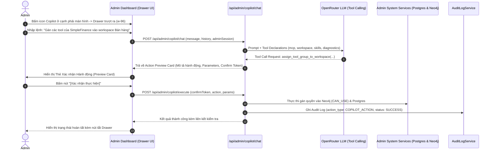

# Đặc tả Tính năng: Trợ lý Quản trị Thông minh (Admin AI Copilot Drawer)

> **Mã tính năng:** `FEAT-ADMIN-COPILOT`  
> **Phân hệ phụ trách:** Module 1 (Admin Dashboard) & Module 5 (Multi-Agent Engine)  
> **Trạng thái:** Approved by Admin & Ready for Implementation  
> **Ngày phê duyệt:** 2026-09-29  

---

## 1. Mục tiêu Tính năng (Feature Goal)

Xây dựng một **Admin AI Copilot** hoạt động dưới dạng **Slide-over Right Sidebar Drawer** cố định trên toàn bộ giao diện quản trị (`/admin/*`). Trợ lý AI này kết nối với mô hình LLM qua OpenRouter Gateway (`OPENROUTER_API_KEY`), được trang bị bộ công cụ **Function Calling nội bộ** giúp quản trị viên thực hiện nhanh các tác vụ vận hành phức tạp bằng ngôn ngữ tự nhiên:

1. **Quản lý & Thêm nhanh MCP Server:** Phân tích cú pháp cấu hình JSON `mcpServers` hoặc URL, tự động gọi handshake `tools/list`, tạo ToolGroup và đồng bộ Tool vào PostgreSQL & Neo4j.
2. **Phân quyền Workspace linh hoạt:** Tra cứu quyền hiện tại của Workspace, gán Tool/ToolGroup vào Workspace hoặc thu hồi quyền chỉ qua một câu lệnh.
3. **Quản lý & Dạy Skill mới:** Tạo nhanh Skill cho AI Agent (System prompt, description, dependency tools) và liên kết với Workspace tương ứng.
4. **Giám sát & Chẩn đoán hệ thống:** Tra cứu Audit log gần nhất theo Workspace/User, kiểm tra trạng thái hoạt động của các nhóm Zalo & kênh Telegram.
5. **Cơ chế An toàn (Human-in-the-Loop):** Trước khi thực thi bất kỳ thao tác thay đổi dữ liệu nào (thêm/xóa/gán quyền), Copilot phải render một **Action Preview Card** trong khung chat để Admin nhấn `[Xác nhận thực hiện]` hoặc `[Hủy]`. Mọi thao tác đều được ghi vết vào bảng `audit_logs` với `action_type = 'COPILOT_ACTION'`.

---

## 2. Luồng Trải nghiệm Người dùng (User Flow)



---

## 3. Thiết kế Giao diện (UI Layout & Google Stitch Prompt)

### 3.1. Cấu trúc Drawer (Slide-over Right Sidebar)
* **Vị trí & Kích thước:** Nằm cố định ở mép phải màn hình (`fixed top-0 right-0 h-full w-[400px] z-50`), có hiệu ứng trượt mượt mà (slide-in/slide-out).
* **Nút mở (Trigger Button):** Floating badge cố định ở cạnh phải (`right-0 top-1/2 -translate-y-1/2` hoặc góc dưới phải `bottom-6 right-6`), icon lấp lánh (Sparkle/Bot) kèm badge "Copilot".
* **Header:**
  * Tiêu đề: "Admin Copilot".
  * Badge trạng thái: "Online (OpenRouter)".
  * Action buttons: Nút "New Chat" (xóa hội thoại cục bộ) và Nút đóng Drawer (icon `X`).
* **Message Body:**
  * Hiển thị tin nhắn dạng bong bóng đối thoại (User & Assistant).
  * Hỗ trợ Markdown, code block cú pháp, và **Action Preview Cards**.
  * Quick Suggestion Chips khi khung chat rỗng:
    * *"Thêm MCP Server tài chính"*
    * *"Kiểm tra quyền Workspace Bán hàng"*
    * *"Dạy skill tra cứu đơn hàng"*
* **Action Preview Card Component:**
  * Viền màu xanh tím/indigo nổi bật.
  * Tóm tắt hành động rõ ràng: `Hành động: Gán Tool Group`, `Mục tiêu: Workspace Bán hàng`, `Số tool: 20 tools`.
  * 2 nút bấm tương tác:
    * `[Xác nhận thực hiện]` (Nút màu xanh đậm, có loading state).
    * `[Hủy bỏ]` (Nút màu xám nhạt).
* **Footer Input:**
  * Textarea tự co giãn (Auto-expanding) tối đa 4 dòng.
  * Phím tắt: `Enter` để gửi, `Shift + Enter` để xuống dòng.

### 3.2. Google Stitch Prompt
```text
Create a modern, high-tech Slide-over Drawer for an AI Admin Copilot in a Tailwind CSS dashboard.
Layout specs:
- Width 400px, full height, right-aligned, slide-over animation with light backdrop blur.
- Header: Deep slate background, title 'Admin AI Copilot' with a vibrant gradient indigo-purple badge 'Connected', action buttons for 'Reset Chat' (rotate icon) and 'Close Drawer' (X icon).
- Body: Scrollable chat stream with message bubbles. System assistant messages feature sleek dark border cards for 'Action Proposals' with two action buttons: primary 'Confirm Action' (emerald green) and secondary 'Cancel' (slate gray).
- Quick Prompts: Pill buttons above the input box with quick actions like 'Import MCP Server', 'List Workspace Tools', 'Audit Recent Logs'.
- Input Footer: Modern rounded textarea with send button (paper airplane icon), character counter, and shortcut hint 'Enter to send, Shift+Enter for new line'.
```

---

## 4. Đặc tả API Contracts & Function Calling

### 4.1. Endpoint 1: Trò chuyện & Phân tích Ý định
* **Endpoint:** `POST /api/admin/copilot/chat`
* **Quyền hạn:** `ADMIN`, `SUPER_ADMIN`
* **Request Body:**
```json
{
  "message": "Gán toàn bộ tool nhóm simplefinance vào workspace e8b5...",
  "history": [
    { "role": "user", "content": "..." },
    { "role": "assistant", "content": "..." }
  ]
}
```
* **Response:**
```json
{
  "success": true,
  "reply": "Tôi đã chuẩn bị thao tác gán nhóm công cụ vào workspace. Vui lòng xác nhận bên dưới.",
  "action_preview": {
    "action_id": "act_8f7b2c",
    "action_type": "ASSIGN_TOOL_GROUP_TO_WORKSPACE",
    "summary": "Gán ToolGroup 'simplefinance' (20 tools) vào Workspace 'Bán Hàng'",
    "parameters": {
      "workspace_id": "e8b5...",
      "tool_group_key": "simplefinance"
    }
  }
}
```

### 4.2. Endpoint 2: Xác nhận Thực thi Hành động (Execute Action)
* **Endpoint:** `POST /api/admin/copilot/execute`
* **Request Body:**
```json
{
  "action_id": "act_8f7b2c",
  "action_type": "ASSIGN_TOOL_GROUP_TO_WORKSPACE",
  "parameters": {
    "workspace_id": "e8b5...",
    "tool_group_key": "simplefinance"
  }
}
```
* **Response:**
```json
{
  "success": true,
  "message": "Đã gán thành công 20 công cụ của nhóm 'simplefinance' vào Workspace 'Bán Hàng'.",
  "result_data": {
    "affected_tools": 20,
    "workspace_id": "e8b5..."
  }
}
```

---

## 5. Danh mục 4 Nhóm Function Calling nội bộ

1. **`mcp_management`:**
   - `inspect_mcp_server(url, raw_config)`: Kiểm tra handshake MCP từ xa.
   - `import_mcp_server(name, key, url, selected_tools)`: Tạo ToolGroup và nạp Tools.
   - `sync_mcp_server(tool_group_id)`: Đồng bộ cập nhật tools từ remote MCP server.
2. **`workspace_permissions`:**
   - `list_workspace_permissions(workspace_id)`: Liệt kê các Tool/Skill mà Workspace đang có quyền dùng.
   - `assign_tool_to_workspace(workspace_id, tool_id)`: Gán quyền 1 tool.
   - `assign_tool_group_to_workspace(workspace_id, tool_group_id)`: Gán quyền cả cụm tool.
   - `remove_tool_from_workspace(workspace_id, tool_id)`: Thu hồi quyền tool.
3. **`skill_management`:**
   - `create_skill(key, name, description, system_prompt, tool_ids)`: Tạo skill mới.
   - `assign_skill_to_workspace(workspace_id, skill_id)`: Gán skill cho workspace.
4. **`system_diagnostics`:**
   - `get_recent_audit_logs(limit, workspace_id, action_type)`: Tra cứu audit log gần nhất.
   - `check_channel_status(channel_id)`: Kiểm tra cấu hình và webhook Zalo/Telegram.

---

## 6. Kế hoạch Triển khai (Task Breakdown)

- [ ] **Task 1: Xây dựng Core Dispatcher & LLM Gateway (`packages/core/src/copilot`)**
  - Khai báo JSON Schema cho 4 nhóm Function Calling.
  - Xây dựng handler kết nối OpenRouter với system prompt chuyên sâu về hệ thống phân quyền Zalo/Telegram.
- [ ] **Task 2: Xây dựng Backend API Endpoints**
  - Tạo `apps/web/src/app/api/admin/copilot/chat/route.ts`.
  - Tạo `apps/web/src/app/api/admin/copilot/execute/route.ts` với xác thực phiên Admin và ghi Audit Log `COPILOT_ACTION`.
- [ ] **Task 3: Xây dựng UI Component Slide-over Drawer**
  - Component `apps/web/src/components/admin/copilot-drawer.tsx`.
  - Action Preview Card với 2 nút `Confirm` / `Cancel`.
  - Quick action chips & markdown streaming renderer.
- [ ] **Task 4: Tích hợp vào Layout Quản trị (`apps/web/src/app/admin/layout.tsx`)**
  - Hiển thị trigger button cố định trên mọi màn hình admin.
  - Lưu trạng thái mở/đóng và lịch sử chat vào LocalStorage.
- [ ] **Task 5: Kiểm thử Toàn diện & Triển khai lên Production**
  - Test tương tác thêm MCP server từ chat.
  - Test gán quyền workspace và kiểm tra audit log.
