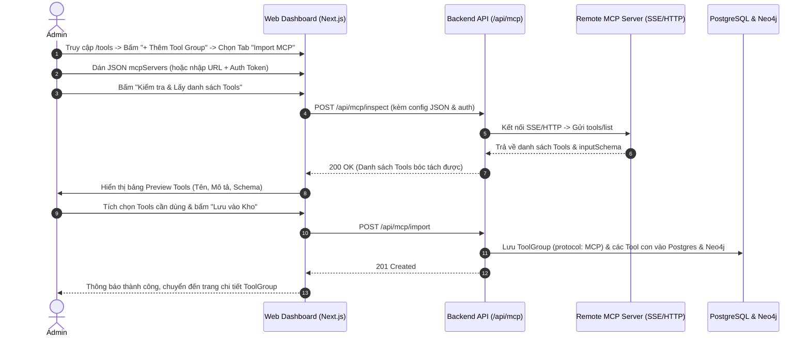

# Đặc tả Tính năng: Tích hợp Nhanh Hệ thống MCP (Native Model Context Protocol Hub)

> **Mã tính năng:** `FEAT-MCP-INTEGRATION`  
> **Phân hệ phụ trách:** Module 2 (Tool & Skill Catalog) & Module 5 (Multi-Agent Engine)  
> **Trạng thái:** Approved & Ready for Implementation

---

## 1. Mục tiêu Tính năng (Feature Goal)

Cho phép quản trị viên tích hợp nhanh bất kỳ hệ thống **Model Context Protocol (MCP)** nào vào nền tảng OmniAgent bằng cách **copy-paste nguyên khối cấu hình JSON tiêu chuẩn** (`mcpServers` format từ Claude Desktop/Cursor) hoặc nhập trực tiếp Endpoint URL. 

Hệ thống sẽ:
1. Tự động bóc tách cấu hình (Server Name, Endpoint URL).
2. Kết nối trực tiếp qua giao thức chuẩn MCP (`@modelcontextprotocol/sdk`) để handshake và lấy danh sách Tools (`tools/list`) cùng đầy đủ JSON Schema mà không cần cấu hình thủ công từng API.
3. Cho phép Admin xem trước (Preview) và chọn lọc các Tool nạp vào kho.
4. Cung cấp nút **Đồng bộ thủ công (Sync Tools)** khi server MCP bên ngoài có cập nhật mới.
5. Hỗ trợ cơ chế bảo mật **2 cấp độ**: Master Default Token và Workspace Scoped Vault Token (mã hóa AES-256-GCM).
6. Tích hợp cơ chế **Native Direct MCP Execution** trong Worker Agent với Timeout 15s và xử lý lỗi lịch sự gửi về luồng chat Zalo/Telegram.

---

## 2. Luồng Trải nghiệm Người dùng (User Flow)



### Luồng Đồng bộ Công cụ (On-Demand Sync Flow):
Khi MCP Server có thêm tính năng mới, Admin vào `/tools/groups/[id]` bấm **"Đồng bộ từ Server (Sync Tools)"**. Backend sẽ gọi lại `tools/list`, tự động bổ sung tool mới vào DB/Neo4j và cập nhật schema mà **không làm mất cấu hình biến Scoped Vault hay phân quyền Workspace đã thiết lập trước đó**.

---

## 3. Thiết kế Giao diện (UI Layout & Google Stitch Prompt)

### 3.1. Modal Import Cấu hình MCP trên trang `/tools`
* **Tab 1: REST API thủ công** (giao diện cũ).
* **Tab 2: Import Cấu hình MCP (Mới):**
  * Textarea nhập JSON cấu hình `mcpServers` (hỗ trợ auto-format & syntax validation).
  * Hàng cấu hình nhận diện tự động:
    * Server Key / Name: (Tự điền, ví dụ: `simplefinance`).
    * Protocol: Badge `MCP (SSE / Streamable HTTP)`.
    * Target Endpoint: (Tự điền, ví dụ: `https://financemcp.oa.io.vn/mcp.php`).
    * Default Auth Token / Secret Key: Input text với chế độ ẩn/hiện mật khẩu.
  * Nút hành động: `Inspect & Fetch Tools` (Kiểm tra kết nối & lấy Tools).
  * **Khu vực Preview Tools:** Bảng danh sách các tool nhận diện được:
    * Checkbox chọn/bỏ chọn từng Tool (nút "Chọn tất cả" trên header).
    * Badge Tên Tool (`get_balance`, `create_transaction`).
    * Mô tả nghiệp vụ tóm tắt.
    * Nút xem chi tiết JSON Schema (Parameters Drawer).
  * Footer: Nút `Hủy` và nút `Xác nhận & Lưu vào Kho Master`.

### 3.2. Google Stitch Prompt (Prompt thiết kế UI chuẩn)
```text
Design a sleek, modern modal dialog for "Import MCP Server Configuration" in dark mode SaaS theme (Linear/Vercel aesthetic).
Modal title: "Connect Model Context Protocol (MCP) Server" with a subtext "Paste your mcpServers JSON snippet or enter remote endpoint to auto-discover tools."
Top section has two toggle pill tabs: "Paste JSON Config" (active) and "Direct URL Connection".
Inside "Paste JSON Config":
A code textarea with dark monospace editor styling containing sample JSON:
{
  "mcpServers": {
    "simplefinance": {
      "command": "npx",
      "args": ["-y", "mcp-proxy", "https://financemcp.oa.io.vn/mcp.php"]
    }
  }
}
Below the code editor:
- Parsed Server Name field: "simplefinance" with a green checkmark "Valid JSON".
- Detected Target URL: "https://financemcp.oa.io.vn/mcp.php" (Badge: Remote SSE).
- "Master Default Auth Token" input field with placeholder "Bearer eyJhbGci... or API Key".
A primary action button with a spark icon: "Inspect & Fetch Tools".

Below the button, an expandable card showing "Discovered Tools (4 available)":
A high-density table with header checkboxes:
- Row 1: Checked, Tool name "get_account_balance", Description "Retrieve current available balance by currency", parameters badge "currency: string".
- Row 2: Checked, Tool name "list_transactions", Description "Query latest financial transactions with date range filters".
- Row 3: Checked, Tool name "transfer_funds", Description "Initiate fund transfer between internal ledger accounts".
Bottom modal footer: "Cancel" outline button and a prominent "Save 3 Tools to Catalog" blue/violet gradient button.
```

---

## 4. Thay đổi Cơ sở Dữ liệu (Schema Diff)

### 4.1. Cập nhật Prisma Schema (`packages/database/prisma/schema.prisma`)

```prisma
enum ProtocolType {
  REST
  MCP
}

enum McpTransportType {
  SSE
  STREAMABLE_HTTP
}

model ToolGroup {
  id                 String           @id @default(uuid()) @db.Uuid
  key                String           @unique
  name               String
  description        String?
  protocolType       ProtocolType     @default(REST) // Mới: Phân loại REST vs MCP
  baseUrl            String           // Lưu endpoint SSE/HTTP nếu là MCP
  mcpTransport       McpTransportType? @default(SSE) // Mới: Loại transport
  mcpRawConfig       Json?            // Mới: Lưu nguyên bản JSON config người dùng dán vào
  timeoutSeconds     Int              @default(15)   // Mới: Timeout khi gọi tool (15s)
  authType           AuthType         @default(NONE)
  defaultAuthConfig  Json?            @default("{}")
  defaultHeaders     Json?            @default("{}")
  requiredVariables  Json             @default("[]")
  isActive           Boolean          @default(true)
  createdAt          DateTime         @default(now())
  updatedAt          DateTime         @updatedAt

  tools                Tool[]
  workspaceToolConfigs WorkspaceToolConfig[]

  @@map("tool_groups")
}

model Tool {
  id               String       @id @default(uuid()) @db.Uuid
  toolGroupId      String       @db.Uuid
  key              String       @unique
  name             String
  description      String
  method           HttpMethod?  @default(POST) // Optional với MCP tools
  path             String?      @default("/call") // Optional với MCP tools
  parametersSchema Json?        @default("{}") // Lưu JSON Schema inputSchema của MCP tool
  bodySchema       Json?        @default("{}")
  responseSchema   Json?        @default("{}")
  isActive         Boolean      @default(true)
  createdAt        DateTime     @default(now())
  updatedAt        DateTime     @updatedAt

  toolGroup ToolGroup @relation(fields: [toolGroupId], references: [id], onDelete: Cascade)

  @@index([toolGroupId])
  @@map("tools")
}
```

### 4.2. Cập nhật Neo4j Graph Model
Node `ToolGroup` trong Neo4j được bổ sung thuộc tính:
* `protocol: 'MCP'`
* `server_url: 'https://...'`

---

## 5. Hợp đồng Dữ liệu API (API Contracts)

### 5.1. Kiểm tra & Bóc tách Tools từ Cấu hình MCP
* **Endpoint:** `POST /api/mcp/inspect`
* **Request Payload:**
```json
{
  "raw_config": {
    "mcpServers": {
      "simplefinance": {
        "command": "npx",
        "args": ["-y", "mcp-proxy", "https://financemcp.oa.io.vn/mcp.php"]
      }
    }
  },
  "default_auth_token": "Bearer test_secret_123"
}
```
* **Response Status:** `200 OK`
* **Response Payload:**
```json
{
  "success": true,
  "data": {
    "server_name": "simplefinance",
    "target_url": "https://financemcp.oa.io.vn/mcp.php",
    "transport": "SSE",
    "tools": [
      {
        "name": "get_account_balance",
        "description": "Lấy số dư tài khoản theo mã tiền tệ",
        "parameters_schema": {
          "type": "object",
          "properties": {
            "currency": { "type": "string", "description": "VND, USD" }
          },
          "required": ["currency"]
        }
      },
      {
        "name": "transfer_funds",
        "description": "Chuyển tiền nội bộ giữa các tài khoản",
        "parameters_schema": {
          "type": "object",
          "properties": {
            "to_account": { "type": "string" },
            "amount": { "type": "number" }
          },
          "required": ["to_account", "amount"]
        }
      }
    ]
  }
}
```

### 5.2. Nhập MCP Server & Tạo ToolGroup kèm Tools
* **Endpoint:** `POST /api/mcp/import`
* **Request Payload:**
```json
{
  "key": "simplefinance",
  "name": "SimpleFinance MCP Server",
  "description": "Tích hợp hệ thống quản lý tài chính doanh nghiệp",
  "target_url": "https://financemcp.oa.io.vn/mcp.php",
  "transport": "SSE",
  "timeout_seconds": 15,
  "default_auth_token": "Bearer test_secret_123",
  "raw_config": { ... },
  "selected_tools": [
    {
      "key": "simplefinance_get_account_balance",
      "name": "Lấy số dư tài khoản",
      "description": "Lấy số dư tài khoản theo mã tiền tệ",
      "parameters_schema": { ... }
    }
  ]
}
```
* **Response Status:** `201 Created`

### 5.3. Đồng bộ lại Công cụ từ Server MCP (On-demand Sync)
* **Endpoint:** `POST /api/tool-groups/{id}/mcp/sync`
* **Response Status:** `200 OK`
* **Response Payload:**
```json
{
  "success": true,
  "data": {
    "total_tools": 5,
    "added_tools": 1,
    "updated_tools": 4
  }
}
```

---

## 6. Cơ chế Thực thi Runtime & Xử lý Ngoại lệ (Runtime Engine)

1. **Khởi tạo MCP Client trong `packages/core/src/tools/mcp-executor.ts`:**
   * Sử dụng `@modelcontextprotocol/sdk/client/index.js` và `SSEClientTransport`.
   * Gắn Authorization Header lấy từ:
     * `WorkspaceToolConfig.variableValues['AUTH_TOKEN']` (nếu Workspace có ghi đè - giải mã AES-256-GCM).
     * Hoặc `ToolGroup.defaultAuthConfig['token']` (mặc định của Master).
2. **Quản lý Timeout & Circuit Breaker:**
   * Thiết lập `AbortSignal.timeout(15000)`.
   * Nếu quá 15 giây hoặc server MCP trả lỗi HTTP 5xx:
     * Trả về kết quả có cấu trúc: `{ success: false, error_type: "MCP_TIMEOUT_OR_UNAVAILABLE", message: "Hệ sinh thái [simplefinance] phản hồi chậm hoặc đang bảo trì." }`.
     * Worker Agent đọc thông điệp này và trả lời người dùng trên Zalo/Telegram một cách tự nhiên và lịch sự.
     * Ghi trạng thái `FAILED` kèm thời gian phản hồi vào bảng `audit_logs`.

---

## 7. Kế hoạch Phân chia Công việc (Task Breakdown)

| Task ID | Tên công việc | Phân hệ phụ trách | DoD (Tiêu chuẩn nghiệm thu) |
| :--- | :--- | :--- | :--- |
| **TASK-204** | Xây dựng Module Bóc tách Config & Ping MCP Server | `packages/core` & Backend API | Viết parser phân tích JSON `mcpServers` và hàm gọi `tools/list` qua SSE test thành công. |
| **TASK-205** | Xây dựng Native MCP Tool Executor & Timeout Handler | `packages/core` (Agent Worker) | Gọi thử nghiệm `callTool` thành công, xử lý ngắt kết nối đúng 15s khi server timeout. |
| **TASK-305** | Xây dựng Giao diện Modal Import MCP Config & Preview Table | `apps/web` (Dashboard) | Cho phép paste JSON, fetch danh sách tool trực quan, chọn tool và lưu vào DB. |
| **TASK-306** | Thêm Nút Sync Tools & Badge MCP trong ToolGroup Detail | `apps/web` (Dashboard) | Bấm "Sync Tools" hiển thị thông báo số lượng tool mới/cập nhật thành công. |
