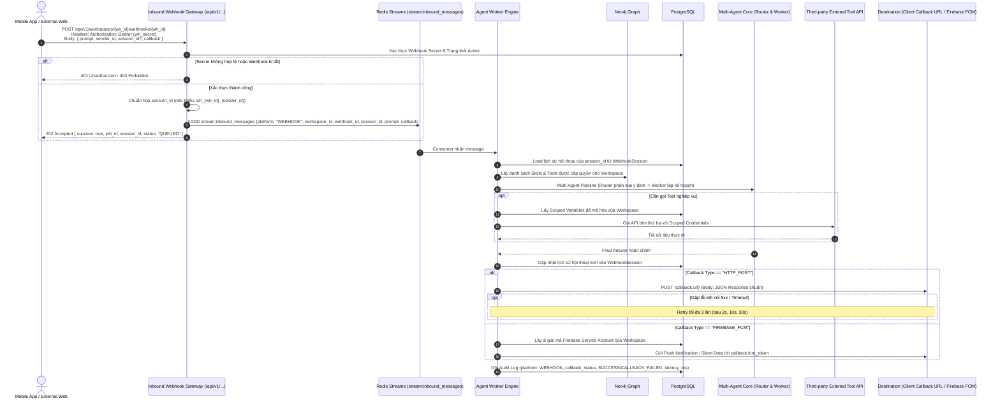

# Đặc tả Tính năng: Kênh Giao tiếp Webhook Đa kênh Bất đồng bộ & Firebase FCM Push (Workspace Inbound Webhooks & Async Callback)

> **Mã tính năng:** `FEAT-WORKSPACE-WEBHOOKS`  
> **Phân hệ phụ trách:** Module 1 (Workspace Hub), Module 4 (Scoped Vault / Firebase Credentials), Module 5 (Multi-Agent Engine - Inbound/Outbound Gateway)  
> **Trạng thái:** Approved by Admin & Ready for Implementation  
> **Ngày phê duyệt:** 2026-10-01  

---

## 1. Mục tiêu Tính năng (Feature Goal)

Mở rộng năng lực kết nối của nền tảng OmniAgent bằng cách bổ sung kênh **Inbound Webhook** theo từng Không gian làm việc (Workspace). Tính năng này cho phép các ứng dụng vệ tinh bên ngoài (Mobile App iOS/Android, Website cổng thông tin khách hàng, Hệ thống ERP/CRM bên thứ ba) gửi yêu cầu trực tiếp vào Agent của Workspace thay vì chỉ tương tác qua nhóm chat Zalo hoặc Telegram:

1. **Khởi tạo Đa Webhook per Workspace:** Mỗi Workspace có thể tạo một hoặc nhiều Webhook Endpoint riêng biệt (ví dụ: một Webhook cho App Khách hàng, một Webhook cho Landing Page Bán hàng, một Webhook cho Backend ERP).
2. **Quy trình Xử lý Độc lập Kênh (Channel-Agnostic Agent Execution):** Dữ liệu truyền từ Webhook được đưa vào chu trình Multi-Agent tiêu chuẩn của hệ thống: Tra cứu Workspace $\rightarrow$ Router Agent (Gemini 2.0 Flash) phân loại ý định & khớp Skill $\rightarrow$ Worker Agent (Claude 3.5 Sonnet) lập kế hoạch ReAct & gọi Tool với Scoped Variables mã hóa của Workspace.
3. **Cơ chế Phản hồi Bất đồng bộ (Asynchronous Request-Response):**
   * Client gửi HTTP POST đến Webhook, hệ thống xác thực token và đưa tin nhắn vào Redis Stream, phản hồi ngay `202 Accepted` kèm `job_id` và `session_id`.
   * Worker Agent xử lý ngầm và phản hồi kết quả về client thông qua **Dynamic Callback Payload**:
     * **HTTP POST Callback:** Bắn JSON kết quả về URL của đối tác (`callback.url`), có cơ chế thử lại (Retry) 3 lần theo thuật toán Exponential Backoff (2s, 10s, 30s).
     * **Firebase Cloud Messaging (FCM) Push:** Đẩy thông báo Push trực tiếp đến thiết bị di động của người dùng (`callback.fcm_token`) thông qua Firebase Admin SDK sử dụng Credentials đã mã hóa của Workspace.
4. **Duy trì Ngữ cảnh Hội thoại Đa lượt (Multi-turn Conversation Context):** Hỗ trợ `session_id` trong payload để ghi nhớ lịch sử chat liên tục giữa người dùng và Agent. Nếu client không truyền, hệ thống tự động sinh `session_id` định danh duy nhất theo cú pháp `wh_{webhook_id}_{sender_id}`.
5. **Bảo mật Đa tầng:**
   * Inbound Request được bảo vệ bằng Secret Token ngẫu nhiên (Bearer Token / Header `X-Webhook-Secret`).
   * Firebase Service Account Key của từng Workspace được mã hóa chuẩn **AES-256-GCM** lưu trong PostgreSQL.

---

## 2. Luồng Trải nghiệm & Trình tự Xử lý (User Flow & Sequence Diagram)

### 2.1. Sơ đồ Tuần tự Chi tiết (End-to-End Sequence Diagram)



---

## 3. Thiết kế Giao diện (UI Layout & Google Stitch Prompts)

### 3.1. Tab "Webhooks" trong Màn hình Chi tiết Workspace (`/workspaces/[id]?tab=webhooks`)

* **Header Phân hệ:**
  * Tiêu đề: "Danh sách Inbound Webhooks".
  * Mô tả: "Cung cấp các cổng API nhận yêu cầu từ Mobile App, Website hoặc Backend của bên thứ ba vào Workspace này."
  * Nút hành động: Nút `[+ Tạo Webhook Mới]` (Primary button) và nút `[Cấu hình Firebase FCM]` (Outline button với logo Firebase).
* **Bảng Danh sách Webhooks (Webhook Table):**
  * Các cột:
    * **Tên Webhook & Mô tả:** Tên định danh (vd: "App Khách Hàng iOS/Android", "Web Tra Cứu Tồn Kho").
    * **Endpoint URL:** Hiển thị dạng rút gọn `https://api.domain.com/api/v1/.../{id}` kèm nút Copy 1-Click.
    * **Secret Token:** Hiển thị dạng che giấu `whsec_live_••••••••••••` kèm nút Hiện/Ẩn và nút Copy.
    * **Trạng thái (Status):** Switch toggle Active / Inactive.
    * **Ngày tạo & Lần gọi cuối:** Timestamp hiển thị trực quan.
    * **Hành động:** Nút "Làm mới Secret Token" (Rotate Secret), Nút "Xem Audit Logs", Nút "Xóa Webhook".
* **Modal Tạo Webhook Mới (Create Webhook Dialog):**
  * Trường Tên Webhook (bắt buộc, vd: Mobile App CSKH).
  * Trường Mô tả (tùy chọn).
  * Checkbox: "Kích hoạt ngay sau khi tạo".
  * Sau khi bấm tạo: Hiển thị hộp thoại chứa **Secret Token duy nhất một lần** (khuyến cáo người dùng sao chép lưu trữ an toàn) cùng mẫu cURL gọi thử.
* **Drawer / Modal Cấu hình Firebase FCM (Workspace Firebase Settings):**
  * Cấu hình dành cho tính năng gửi Push Notification về Mobile App.
  * Form hỗ trợ:
    * Drag & drop tải lên file `serviceAccountKey.json` từ Firebase Console (tự động parse `project_id`, `client_email`, `private_key`).
    * Hoặc nhập trực tiếp các trường cấu hình.
  * Nút "Kiểm tra kết nối Firebase" (Test Connection).
  * Thông báo mã hóa: "Thông tin Firebase được mã hóa an toàn bằng thuật toán AES-256-GCM."

---

### 3.2. Google Stitch Prompts

#### Prompt 1: Màn hình Quản lý Webhooks của Workspace (Webhooks Tab & Table)
```text
Create a modern, clean Dashboard tab for 'Workspace Inbound Webhooks' in a Tailwind CSS application.
Layout specs:
- Header: Title 'Inbound Webhooks', subtitle explaining it allows external mobile apps and websites to trigger agents asynchronously. On the right, two buttons: secondary button 'Firebase FCM Settings' with Firebase orange flame icon, and primary button '+ Create Webhook' in solid indigo.
- Content: Empty state illustration if none exists, otherwise a sleek data table with columns: 'Name & Purpose', 'Webhook Endpoint URL' (with copy-to-clipboard button and monospace styling), 'Secret Key' (masked dots with eye toggle icon and copy button), 'Status' (iOS-style green toggle switch), 'Last Triggered' (time ago badge), and 'Actions' (three-dots dropdown with Regenerate Secret, View Logs, Delete).
- Visual Style: Slate-900 background or clean white with subtle gray border, crisp typography (Inter/Geist), indigo-500 accents, and tooltips on hover.
```

#### Prompt 2: Modal Cấu hình Firebase Credentials (Firebase FCM Modal)
```text
Create a high-tech modal dialog for configuring 'Workspace Firebase Push Notifications (FCM)'.
Layout specs:
- Modal width: Max-w-lg with smooth backdrop blur.
- Header: Firebase logo with title 'Configure Firebase FCM' and a badge 'AES-256-GCM Encrypted'.
- Body: 
  1. A dashed border drag-and-drop zone for uploading 'serviceAccountKey.json' file with a cloud-arrow icon and text 'Drag JSON file here or browse'.
  2. Divider 'or enter credentials manually'.
  3. Form inputs: Project ID, Client Email, and Private Key (multiline password/secret field).
  4. Security disclaimer banner with a small shield icon explaining that credentials are encrypted per-workspace.
- Footer: Left button 'Test Connection' with a loading spinner, Right buttons 'Cancel' and 'Save Encrypted Credentials' (emerald green).
```

---

## 4. Chi tiết Thay đổi Cơ sở Dữ liệu (Database Schema Diff)

### 4.1. PostgreSQL (Prisma Schema Additions)

Bổ sung 3 bảng mới và cập nhật các bảng hiện có trong `packages/database/prisma/schema.prisma`:

```prisma
// 1. Bổ sung giá trị WEBHOOK vào enum PlatformType
enum PlatformType {
  TELEGRAM
  ZALO
  WEBHOOK
}

// 2. Enum trạng thái gửi callback
enum CallbackStatus {
  NONE
  PENDING
  SUCCESS
  FAILED
  CALLBACK_FAILED
}

// 3. Enum phương thức callback
enum CallbackType {
  HTTP_POST
  FIREBASE_FCM
}

// 4. Bảng quản lý Webhook của Workspace
model WorkspaceWebhook {
  id           String   @id @default(uuid()) @db.Uuid
  workspaceId  String   @db.Uuid
  name         String   @db.VarChar(100)
  description  String?  @db.Text
  secretToken  String   @db.VarChar(255) // Hashed hoặc Encrypted token dùng xác thực Inbound
  isActive     Boolean  @default(true)
  metadata     Json?    @default("{}")
  createdAt    DateTime @default(now())
  updatedAt    DateTime @updatedAt

  workspace    Workspace        @relation(fields: [workspaceId], references: [id], onDelete: Cascade)
  sessions     WebhookSession[]
  auditLogs    AuditLog[]

  @@index([workspaceId])
  @@map("workspace_webhooks")
}

// 5. Bảng cấu hình Firebase FCM cấp Workspace
model WorkspaceFirebaseConfig {
  id                   String   @id @default(uuid()) @db.Uuid
  workspaceId          String   @unique @db.Uuid
  projectId            String   @db.VarChar(100)
  clientEmail          String   @db.VarChar(255)
  encryptedCredentials String   @db.Text // AES-256-GCM chứa toàn bộ private_key và metadata JSON
  isActive             Boolean  @default(true)
  createdAt            DateTime @default(now())
  updatedAt            DateTime @updatedAt

  workspace Workspace @relation(fields: [workspaceId], references: [id], onDelete: Cascade)

  @@map("workspace_firebase_configs")
}

// 6. Bảng lưu trữ Phiên & Lịch sử Hội thoại đa lượt của Webhook
model WebhookSession {
  id           String   @id @default(uuid()) @db.Uuid
  webhookId    String   @db.Uuid
  sessionId    String   @db.VarChar(128) // ID phiên do client truyền hoặc tự sinh
  senderId     String   @db.VarChar(128) // Định danh người dùng bên mobile/web
  messages     Json     @default("[]")   // Mảng [{ role: 'user'|'assistant', content: '...', timestamp: '...' }]
  lastActiveAt DateTime @default(now())
  createdAt    DateTime @default(now())

  webhook WorkspaceWebhook @relation(fields: [webhookId], references: [id], onDelete: Cascade)

  @@unique([webhookId, sessionId])
  @@index([webhookId, senderId])
  @@map("webhook_sessions")
}
```

#### Cập nhật bảng `AuditLog`:
* Thêm trường `webhookId String? @db.Uuid` (khóa ngoại trỏ đến `WorkspaceWebhook`).
* Thêm trường `callbackStatus CallbackStatus @default(NONE)`.
* Thêm trường `callbackType CallbackType?`.
* Thêm trường `callbackTarget String? @db.Text` (Lưu URL hoặc masked FCM token).
* Thêm trường `retryCount Int @default(0)`.

---

### 4.2. Neo4j Graph Model Additions

Tạo Node và Quan hệ để kiểm tra nhanh tính hợp lệ và quan hệ sở hữu trong đồ thị RBAC:

* **Node mới:** `(:WorkspaceWebhook { id: String, name: String, is_active: Boolean })`
* **Quan hệ mới:** `(:WorkspaceWebhook)-[:BELONGS_TO]->(:Workspace)`
* **Cypher Ràng buộc (Constraint):**
  ```cypher
  CREATE CONSTRAINT unique_workspace_webhook_id IF NOT EXISTS 
  FOR (wh:WorkspaceWebhook) REQUIRE wh.id IS UNIQUE;
  ```
* **Cypher Tra cứu Workspace từ Webhook:**
  ```cypher
  MATCH (wh:WorkspaceWebhook { id: $webhook_id, is_active: true })-[:BELONGS_TO]->(w:Workspace { is_active: true })
  RETURN w.id AS workspace_id, w.name AS workspace_name;
  ```

---

## 5. Đặc tả Hợp đồng Dữ liệu API (API Contracts)

### 5.1. Inbound Webhook Execution Endpoint (Dành cho Mobile App & Web Client)

* **Endpoint:** `POST /api/v1/workspaces/{workspace_id}/webhooks/{webhook_id}`
* **Xác thực:** Header `Authorization: Bearer <secret_token>` hoặc `X-Webhook-Secret: <secret_token>`
* **Request Payload:**
```json
{
  "prompt": "Kiểm tra tồn kho sản phẩm ABC",
  "sender_id": "user_mobile_0901234567",
  "session_id": "sess_order_check_01", 
  "callback": {
    "type": "HTTP_POST",
    "url": "https://api.my-app.com/v1/agent/callback"
  }
}
```
*(Nếu là Mobile App sử dụng Firebase FCM):*
```json
{
  "prompt": "Kiểm tra đơn hàng DH-9981",
  "sender_id": "user_mobile_0901234567",
  "callback": {
    "type": "FIREBASE_FCM",
    "fcm_token": "eK3lZ...fcm_registration_token_here..."
  }
}
```
* **Response Status:** `202 Accepted`
* **Response Payload:**
```json
{
  "success": true,
  "message": "Message accepted and queued for agent processing",
  "data": {
    "job_id": "job_9b1deb4d-3b7d-4bad-9bdd-2b0d7b3dcb6d",
    "session_id": "sess_order_check_01",
    "status": "QUEUED",
    "received_at": "2026-10-01T12:00:00Z"
  }
}
```

---

### 5.2. Chuẩn Outbound Callback Payload (Gửi về Client / FCM Data)

Khi Worker Agent hoàn thành xử lý, hệ thống sẽ thực hiện gọi HTTP POST tới `callback.url` hoặc đẩy tin qua Firebase FCM với cấu trúc JSON chuẩn sau:

```json
{
  "event": "agent.response",
  "job_id": "job_9b1deb4d-3b7d-4bad-9bdd-2b0d7b3dcb6d",
  "session_id": "sess_order_check_01",
  "sender_id": "user_mobile_0901234567",
  "user_prompt": "Kiểm tra tồn kho sản phẩm ABC",
  "response": "Sản phẩm ABC hiện còn 15 chiếc trong kho chi nhánh Hà Nội.",
  "status": "SUCCESS",
  "error": null,
  "metadata": {
    "workspace_id": "ws_hanoi_uuid",
    "webhook_id": "wh_mobile_uuid",
    "audit_log_id": "audit_log_uuid",
    "execution_time_ms": 1420,
    "completed_at": "2026-10-01T12:00:01.420Z"
  }
}
```

#### Quy chuẩn Thử lại khi Callback lỗi (Retry Policy):
* **Áp dụng cho:** `HTTP_POST` callback khi server đối tác phản hồi mã lỗi `5xx` hoặc Timeout (`> 5000ms`).
* **Số lần thử:** Tối đa 3 lần thử lại.
* **Thời gian giãn cách:**
  * Lần 1: Sau 2 giây.
  * Lần 2: Sau 10 giây.
  * Lần 3: Sau 30 giây.
* **Xử lý khi thất bại toàn bộ:** Cập nhật `audit_logs.callback_status = 'CALLBACK_FAILED'`, ghi log chi tiết lỗi để hiển thị cảnh báo trên Admin Dashboard.

---

### 5.3. Các API Quản trị Webhooks trên Web Dashboard

#### A. Lấy danh sách Webhook của Workspace
* **Endpoint:** `GET /api/workspaces/{id}/webhooks`
* **Response Status:** `200 OK`

#### B. Tạo mới Webhook trong Workspace
* **Endpoint:** `POST /api/workspaces/{id}/webhooks`
* **Request Payload:**
```json
{
  "name": "Mobile App Android CSKH",
  "description": "Nhận tin từ ứng dụng mobile của khách hàng",
  "is_active": true
}
```
* **Response Status:** `201 Created`
* **Response Payload:** Trả về đối tượng Webhook kèm theo `secret_token` dạng thô (chỉ trả về 1 lần duy nhất lúc tạo).

#### C. Sinh lại Secret Token (Regenerate Secret)
* **Endpoint:** `POST /api/workspaces/{id}/webhooks/{webhook_id}/regenerate-secret`
* **Response Status:** `200 OK`

#### D. Bật / Tắt hoặc Xóa Webhook
* **Endpoint:** `PATCH /api/workspaces/{id}/webhooks/{webhook_id}` (Bật/tắt)
* **Endpoint:** `DELETE /api/workspaces/{id}/webhooks/{webhook_id}` (Xóa)

#### E. Cấu hình Firebase FCM của Workspace
* **Endpoint:** `PUT /api/workspaces/{id}/firebase-config`
* **Request Payload:**
```json
{
  "project_id": "omniagent-mobile-app",
  "client_email": "firebase-adminsdk@omniagent-mobile-app.iam.gserviceaccount.com",
  "service_account_json": "{\"type\": \"service_account\", ...}"
}
```
* **Xử lý Backend:** Mã hóa toàn bộ chuỗi JSON bằng AES-256-GCM trước khi ghi vào bảng `workspace_firebase_configs`.

---

## 6. Danh sách Công việc Cần Triển khai (Implementation Tasks)

| Mã Task | Phân hệ | Nhiệm vụ chi tiết | Tiêu chuẩn Nghiệm thu (DoD) |
| :--- | :--- | :--- | :--- |
| **[TASK-WEBHOOK-01]** | Database | Bổ sung Prisma models (`WorkspaceWebhook`, `WorkspaceFirebaseConfig`, `WebhookSession`), cập nhật `AuditLog` & migration. Bổ sung node & constraint Neo4j. | Chạy migration thành công; tạo node Neo4j chuẩn xác. |
| **[TASK-WEBHOOK-02]** | Core Services | Viết `WebhookAuthService` xác thực token; viết `FirebaseAdminService` nạp và cache Firebase App theo từng Workspace với credentials mã hóa. | Unit test mã hóa/giải mã và xác thực token pass 100%. |
| **[TASK-WEBHOOK-03]** | Inbound Gateway | Viết API Route `POST /api/v1/workspaces/[id]/webhooks/[webhook_id]` nhận request, kiểm tra secret, sinh session_id và đẩy vào Redis Stream. | cURL test gửi request nhận HTTP 202 Accepted và job đẩy vào Redis Stream. |
| **[TASK-WEBHOOK-04]** | Agent Worker | Mở rộng Worker Engine: Nhận diện platform `WEBHOOK`, nạp lịch sử từ `WebhookSession`, chạy Multi-Agent pipeline và lưu lại hội thoại mới. | Worker xử lý xong prompt và lưu lịch sử chat vào DB. |
| **[TASK-WEBHOOK-05]** | Outbound Delivery | Xây dựng bộ điều phối Callback: Bắn HTTP POST kèm Exponential Backoff Retry (3 lần) và gửi FCM notification qua Firebase Admin. | Mock server nhận được POST callback; log ghi nhận đúng trạng thái. |
| **[TASK-WEBHOOK-06]** | Web UI | Xây dựng Tab "Webhooks" trong chi tiết Workspace, Dialog tạo Webhook, Drawer cấu hình Firebase FCM và liên kết Audit Log. | Admin thao tác tạo Webhook, copy URL, cấu hình Firebase và xem log mượt mà trên UI. |
